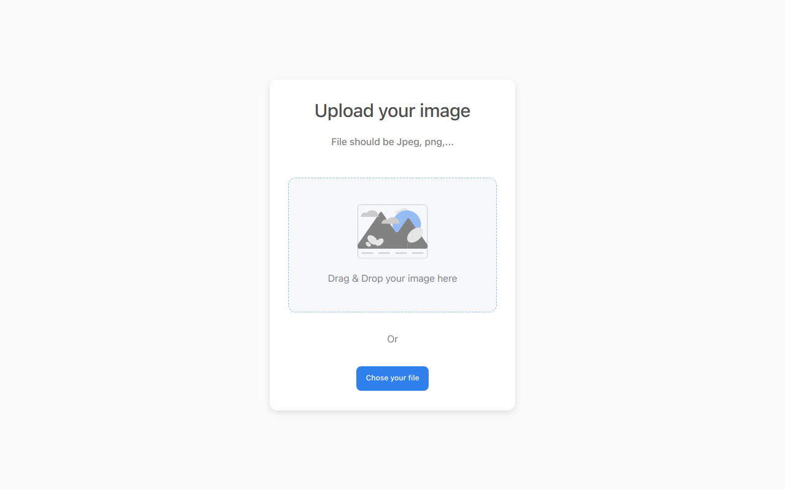

<!-- Please update value in the {}  -->

<h1 align="center">Upload image</h1>

<div align="center">
   Solution for a challenge from  <a href="http://devchallenges.io" target="_blank">Devchallenges.io</a>.
</div>

<div align="center">
  <h3>
    <a href="https://upload-image-one.vercel.app">
      Demo
    </a>
    <span> | </span>
    <a href="https://github.com/fabianoSL1/upload_image">
      Solution
    </a>
    <span> | </span>
    <a href="https://devchallenges.io/challenges/O2iGT9yBd6xZBrOcVirx">
      Challenge
    </a>
  </h3>
</div>

<!-- OVERVIEW -->

## Overview



### Built With

<!-- This section should list any major frameworks that you built your project using. Here are a few examples.-->

- [React](https://reactjs.org/)
- [Nextjs](https://nextjs.org/)
- [chakra-ui](https://chakra-ui.com/)
- [Firebase](https://firebase.google.com/)

## How To Use

<!-- Example: -->
- create a project and a web app
- rename .env.local.example to .env.local and fill variables

```bash
# Clone this repository
$ git clone https://github.com/fabianoSL1/upload_image

# Install dependencies
$ yarn

# Run the app
$ yarn dev
```

 bye
